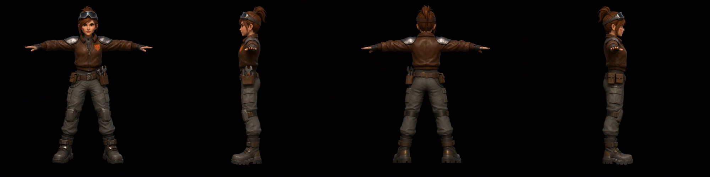

# PixelArtistry-Pixal3D-Multiview

Free & local ComfyUI workflow that turns one prompt into a **4-view character sheet** (front / left / back / right) and feeds it to **Pixal3D Multiview** for a textured 3D mesh. No Nano Banana, no paid API, no custom nodes.

[](LICENSE)
[](https://github.com/comfyanonymous/ComfyUI)
[](https://www.youtube.com/@PixelArtistry_)

> **Video walkthrough:** [VIDEO LINK – TODO]



*Example output of Step 2: one sheet, four views, same character. The image here is a downscaled copy.*

<!-- TODO: add a mesh screenshot (examples/mesh_character.png) once available -->
Download Free Workflow + Model Downloader:

https://github.com/pixelartistry/PixelArtistry-Pixal3D-MultiView

Pixal3D Models (Hugging Face):

https://huggingface.co/Comfy-Org/Pixal3D

Qwen Image 2.1 (Hugging Face):

https://huggingface.co/Qwen/Qwen2.5-VL-7B-Instruct

Pixal3D GGUF Setup:

https://pixel-artistry.com/Pixal3DGGUF

Pixal3D Multiview video:

https://youtu.be/_lgyED4IkJg

Trellis 2 Installation Guide:

https://pixel-artistry.com/Trellis2InstallationGuide
---

## What it does

1. **Front view.** Qwen-Image 2.1 turns your prompt into one T-posed front view on a white background.
2. **Turnaround sheet.** Qwen-Image 2.1 Edit takes that front view and draws a single 4096×1024 row: front, left, back, right.
3. **Split into 4 views.** The sheet is cut into four crops. Background removal and a re-centering step turn each one into a 1024×1024 square.
4. **Pixal3D Multiview.** The four views go into Pixal3D as front / left / back / right (fixed 90° steps). It builds the shape, then the texture.
5. **GLB export.** Post-processing, texture baking and a GLB file. Steps 4–5 are unchanged from the official ComfyUI template.

## Requirements

- **Latest ComfyUI.** Qwen-Image 2.1 and Pixal3D Multiview are core nodes. No custom nodes needed.
- **Disk space:** about 25 GB for the required models, +17.6 GB for the two optional prompt enhancers.
- **VRAM:** around 12 GB in my tests.
- Windows for the model downloader script. On other systems, download the models manually (table below).

## Installation

1. **Update ComfyUI** to the latest version.
2. **Get the models.** Either run the downloader:

   ```
   download_models_win.bat
   ```

   or pass the ComfyUI folder directly: `download_models_win.bat "C:\path\to\ComfyUI"`.
   The script checks for the `models` folder, skips files you already have, and asks before downloading the optional enhancers.

   Or download manually into the folders below:

   | Model | Size | Target folder |
   |---|---|---|
   | [qwen_image_2.1_int8_convrot.safetensors](https://huggingface.co/Comfy-Org/Qwen-Image-2.1/resolve/main/diffusion_models/qwen_image_2.1_int8_convrot.safetensors) | 6.76 GB | `models/diffusion_models` |
   | [pixal3d_multiview_int8_convrot.safetensors](https://huggingface.co/Comfy-Org/Pixal3D/resolve/main/diffusion_models/pixal3d_multiview_int8_convrot.safetensors) | 5.2 GB | `models/diffusion_models` |
   | [qwen3vl_8b_int8_convrot.safetensors](https://huggingface.co/Comfy-Org/Qwen-Image-2.1/resolve/main/text_encoders/qwen3vl_8b_int8_convrot.safetensors) | 8.71 GB | `models/text_encoders` |
   | [qwen_image_2.1_vae_bf16.safetensors](https://huggingface.co/Comfy-Org/Qwen-Image-2.1/resolve/main/vae/qwen_image_2.1_vae_bf16.safetensors) | 644 MB | `models/vae` |
   | [trellis_2_shape_vae_bf16.safetensors](https://huggingface.co/Comfy-Org/Pixal3D/resolve/main/vae/trellis_2_shape_vae_bf16.safetensors) | 1.02 GB | `models/vae` |
   | [trellis_2_texture_vae_bf16.safetensors](https://huggingface.co/Comfy-Org/Pixal3D/resolve/main/vae/trellis_2_texture_vae_bf16.safetensors) | 904 MB | `models/vae` |
   | [dino_v3_L_naf_fp32.safetensors](https://huggingface.co/Comfy-Org/Pixal3D/resolve/main/clip_vision/dino_v3_L_naf_fp32.safetensors) | 1.13 GB | `models/clip_vision` |
   | [birefnet.safetensors](https://huggingface.co/Comfy-Org/BiRefNet/resolve/main/background_removal/birefnet.safetensors) | 424 MB | `models/background_removal` |
   | *Optional:* [qwen3.5_9b_…_pe_t2i.int8_convrot.safetensors](https://huggingface.co/Comfy-Org/Qwen-Image-2.1/resolve/main/text_encoders/qwen3.5_9b_qwen_image_2.1_pe_t2i.int8_convrot.safetensors) | 8.82 GB | `models/text_encoders` |
   | *Optional:* [qwen3.5_9b_…_pe_i2i.int8_convrot.safetensors](https://huggingface.co/Comfy-Org/Qwen-Image-2.1/resolve/main/text_encoders/qwen3.5_9b_qwen_image_2.1_pe_i2i.int8_convrot.safetensors) | 8.82 GB | `models/text_encoders` |

   The two optional prompt enhancers are only used when `refine_prompt` is on. The workflow keeps it off (see [Troubleshooting](#troubleshooting)).

3. **Load the workflow:** drag [`workflows/PixelArtistry_Qwen2.1_Turnaround_to_Pixal3D_Multiview.json`](workflows/PixelArtistry_Qwen2.1_Turnaround_to_Pixal3D_Multiview.json) into ComfyUI.

## Usage

The workflow is split into groups that match the steps above. It also contains notes with the same information.

1. **Step 1 · Text to Image.** Write your character or prop prompt (see the [formula](#the-prompt-formula)). Run once and check the front view. Settings: 1:1, 1 MP, 25 steps, cfg 1, euler / simple. The front view is saved to `output/PixelArtistry/01_front`.
   Tip: while you iterate on Step 1, bypass the later groups (Ctrl+B on the group) so you don't wait for the 3D part every time.
2. **Step 2 · Turnaround sheet.** The front view goes into the Edit node as `<image1>`. Custom size is on: **4096×1024**, so each panel is 1024×1024. Saved to `output/PixelArtistry/02_turnaround_sheet`. If the sheet is wrong, re-roll the seed of this node only.
3. **Step 3 · Split the sheet.** Four crop nodes cut the sheet into front / left / back / right. Background removal plus Crop Image to Mask re-centers each view on a 1024×1024 square. The views are saved to `output/PixelArtistry/03_views/`.
4. **Step 4–5 · Pixal3D Multiview.** Shape, texture, post-processing, texture baking and GLB export. FOV is 20 (the default, recommended for synthetic AI-generated views). The workflow's Save 3D node writes to `output/3d/ComfyUI`.

## The prompt formula

**[Subject] + [Proportions] + [Outfit & materials] + [Pose] + [Camera & framing] + [Lighting] + [Style] + [Clean-up] + [Background]**

Each slot exists because of what Pixal3D does with the image later. The reason for every slot is in [`prompts/prompt_formula.md`](prompts/prompt_formula.md).

Example prompts, Step 1 and Step 2 each:

- [Character: space mechanic](prompts/character.md) (loaded in the workflow by default)
- [Prop: jetpack](prompts/prop_jetpack.md) (from the workflow notes, paste it in yourself)

Keep `refine_prompt` off in both nodes.

## Why the side-view wording matters

A true 90° side view of a T-pose looks odd: one arm points straight at the camera, the other is hidden. Image models avoid that and "cheat" to a 3/4 view unless the profile is described explicitly. 3/4 views break Pixal3D Multiview, which expects fixed 90° steps.

So the Step 2 prompt spells out a real profile: exact 90°, which way the face points, only one eye visible, near arm foreshortened, far arm hidden. It also says the camera orbits a static character, so the pose and head direction stay the same in every view.

For props, describe what the back looks like. Otherwise the model invents one.

## Crop values

These are the values that worked in testing on a 4096-wide sheet:

| View | X | Y | Width | Height |
|---|---|---|---|---|
| Front | 0 | 0 | 1024 | 2688 |
| Left | 1179 | 8 | 746 | 2680 |
| Back | 1973 | 0 | 1149 | 2688 |
| Right | 3225 | 0 | 752 | 2688 |

- **Height 2688 is intentional.** It gets clamped to the real sheet height. Qwen sometimes outputs 4096×1088 instead of 4096×1024.
- **Centering is automatic.** As long as a crop holds exactly one view, Remove Background → Crop Image to Mask re-centers it on a 1024×1024 square.
- **To adjust:** change X and Width of the crop node until it holds only its own view. To see the boxes, load the saved sheet into a Load Image node temporarily.

## Troubleshooting

- **5 views instead of 4:** re-roll the Step 2 seed. When you get a good sheet, lock that seed.
- **Stray hand or a second figure in a crop:** nudge that crop's X / Width until it only holds its own view.
- **Twisted or doubled mesh:** check the sheet for mirrored or 3/4 side views. If the views are correct, swap the left and right inputs on the Pixal3D Multi-View Conditioning node.
- **"No input image connected" on the crop nodes:** this only affects the preview widget, which fills from Load Image nodes. The crop still runs. Check the saved views.
- **`refine_prompt`:** keep it off. The enhancer rewrites your prompt and softens "exact 90° profile" into a nicer angle.
- **Slab or halo around the mesh:** check the background removal previews in Step 3.
- **Thin fingers / merged belt pouches:** normal at this scale. Small inconsistencies between the views get averaged into blobs.

## License

The workflow and scripts in this repo are MIT licensed (see [LICENSE](LICENSE)). **The models are not covered by this license.** Each model keeps its own license, so check them before commercial use.

## Credits

- **Qwen-Image 2.1**: by the Qwen team, repackaged for ComfyUI by Comfy-Org. [Original model](https://huggingface.co/Qwen/Qwen-Image-2.1) · [ComfyUI repackage and license](https://huggingface.co/Comfy-Org/Qwen-Image-2.1)
- **Pixal3D**: by TencentARC, repackaged for ComfyUI by Comfy-Org. [Original model](https://huggingface.co/TencentARC/Pixal3D) · [ComfyUI repackage and license](https://huggingface.co/Comfy-Org/Pixal3D)
- **BiRefNet** (background removal), ComfyUI files by Comfy-Org: [Comfy-Org/BiRefNet](https://huggingface.co/Comfy-Org/BiRefNet)
- **ComfyUI**: [comfyanonymous/ComfyUI](https://github.com/comfyanonymous/ComfyUI) · [license](https://github.com/comfyanonymous/ComfyUI/blob/master/LICENSE)
- **Official ComfyUI templates** this workflow is based on (Qwen-Image 2.1, Pixal3D Multi Views to 3D): [Comfy-Org/workflow_templates](https://github.com/Comfy-Org/workflow_templates)

## Links

[YouTube](https://www.youtube.com/@PixelArtistry_) · [Newsletter: FutureFrames](https://go.pixel-artistry.com/newsletter) · [Discord](https://go.pixel-artistry.com/discord) · [X](https://x.com/philippsieben)
